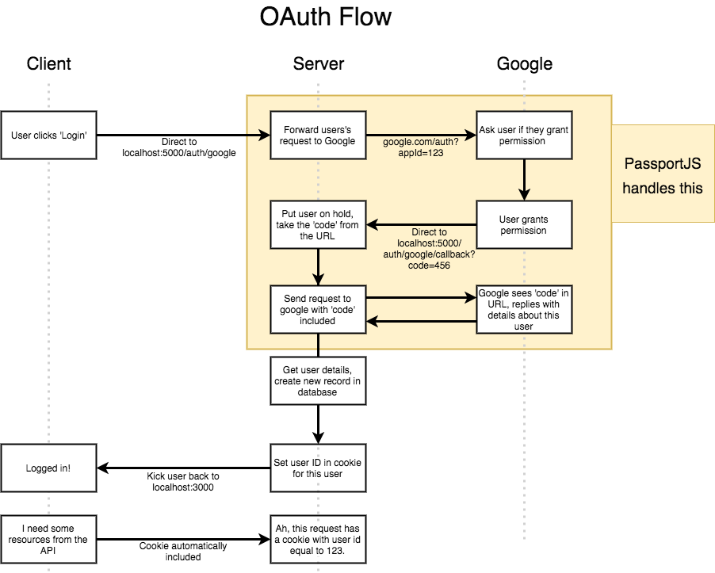

## React Feedback Collection System - Emaily

Powered by Create React App, Redux, Node.js, Express, PassportJS and MongoDB.

### Steps
- cd into server folder and run `npm install` to install the dependencies
- cd into client folder and run `npm install` to install the dependencies
- run `npm run dev` to run the app server
- default port: `localhost:3000`

========================================

### App Flow

1. User signs up via OAuth (Express + MongoDB + PassportJS)
2. User pays for email credits via Stripe (Stripe + MongoDB)
3. User creates a new email campaign (React + Redux)
4. User enters list of emails to send survey (React + Redux + Redux Form)
5. Emaily sends emails to list of surveyees (Email Provider)
6. Surveyees click on link in email to provide feedback (Email Provider + Express + MongoDB)
7. Emaily tabulates and displays feedback (MongoDB)
8. User sees report of all survey responses (MongoDB + React + Redux)

### Application Architecture

Though we can handle all HTTP requests using Node.js itself, we will use Express framework to simplify HTTP traffic handling. Node.js is a Javascript runtime used to execute code outside of browser, while Express is a framework runs in Node.js runtime which makes dealing with HTTP traffic easier.

When users visit our domain, we are going to send them back a React app. Since all the survey data is stored in MongoDB, the React app will communicate with an Express API, which will then retrieve data from MongoDB and send them back to the React app in JSON format.

```
// a helicopter view of the app architecture

React APP
    |
    | HTTP request (JSON)
    |
 Express
    |
 MongoDB
```     

### Node.js and Express

The following diagram shows the relationship between Node.js and Express


We will set our Node.js to listen to port 5000 on our local machine. When an HTTP request comes to port 5000, Node.js will hand the incoming request to Express. Upon receiving the request, Express will look through all the route handlers to determine which one should be responsible for handling the request. The route handler responsible for the request will then process it and generates a response, which will then be sent back to Node.js. Finally, Node.js will send the response back to the request.


### OAuth and PassportJS



1. User clicks 'Login' button and will be directed to localhost:5000/auth/google

2. PassportJS will direct user to Google with an google client ID and client secret to ask for permission


```
/*
When we use PassportJS to handle OAuth, we have to install a general Passport library as well as a Passport strategy. A strategy is used to handle a specific provider, such as, Google, Facebook, etc.
*/

// inform Express to handle OAuth using PassportJS
passport.use(
  new GoogleStrategy(
    {
      clientID: keys.googleClientID,
      clientSecret: keys.googleClientSecret,
      callbackURL: '/auth/google/callback',
      proxy: true
    }, (accessToken, refreshToken, profile, done) => {
      // this callback function is called when authentication is complete
    }
  )
);

// set up the authentication route
app.get(
  '/auth/google',
  passport.authenticate('google', {
    // specify what permissions we ask for
    scope: ['profile', 'email']
  })
);
```

3. User grants permission to the application and be redirected back to an authentication complete URL with a code

4. Extract the code from URL and send request to Google with code included

```
// After user grants permission and Google redirects the user back with a code, Passport extracts the Google code from URL and then asks Google for user details we specified with the Google code included
app.get(
  '/auth/google/callback',
  passport.authenticate('google')
);
```

5. Google sees code in URL and replies with details about the user

6. Authentication is complete and the callback function in passport.use() is executed

```
passport.use(
  new GoogleStrategy(
    {
      clientID: keys.googleClientID,
      clientSecret: keys.googleClientSecret,
      callbackURL: '/auth/google/callback',
      proxy: true
    }, (accessToken, refreshToken, profile, done) => {
      // this callback function is executed
    }
  )
);
```

### MongoDB and Mongoose

MongoDB stores collections, which in turn stores records.

For example, here is a MongoDB database with three collections, namely, Users, Posts and Payments.

MongoDB Collection
----------------------------
| Users | Posts | Payments |
----------------------------

Each collection can have multiple records, with each record a plain Javascript object. Notice that each record can has different properties, which is in stark contrast with traditional database solutions.

MongoDB Record
------------------------------------
| {                  | {           |
|   "id": 1,         |   "id": 2   |
|   "name": "dennis" |   "age": 30 |
|	}                  | }           |
------------------------------------

Mongoose matches a model class to MongoDB collection and a model instance to a MongoDB record, so we can easily manipulate them in Javascript.